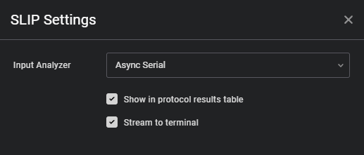
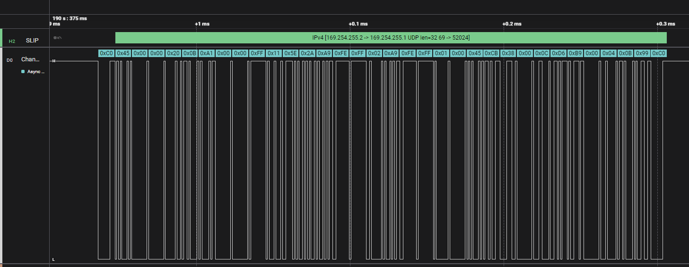

# Serial Line Internet Protocol (SLIP)

A High Level Analyzer that decodes SLIP framed packets and automatically parses IPv4 headers from the payload.

### Features:

- Decodes SLIP framing (handles 0xC0 END markers and 0xDB escape sequences)
- Automatically parses IPv4 headers including source/destination addresses, protocol type, packet lengths, and TCP/UDP port numbers
- Displays combined SLIP and IPv4 information in a single frame
- Reports errors for invalid SLIP escape sequences or malformed IPv4 packets

### Usage:

Attach this analyzer to an Async Serial analyzer in Saleae Logic 2. It will process the serial data and output decoded frames showing both SLIP and IPv4 packet information.

### Output:

- The following shows an example parsed IPv4 packet within the SLIP frame containing a UDP packet.

- The output is also printed to the Terminal and results table for easy export and post-processing.